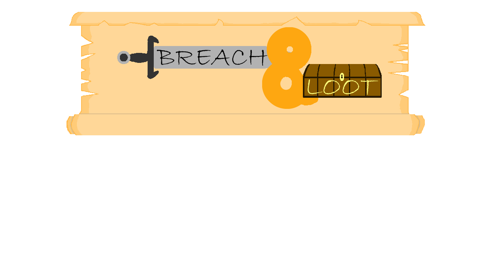
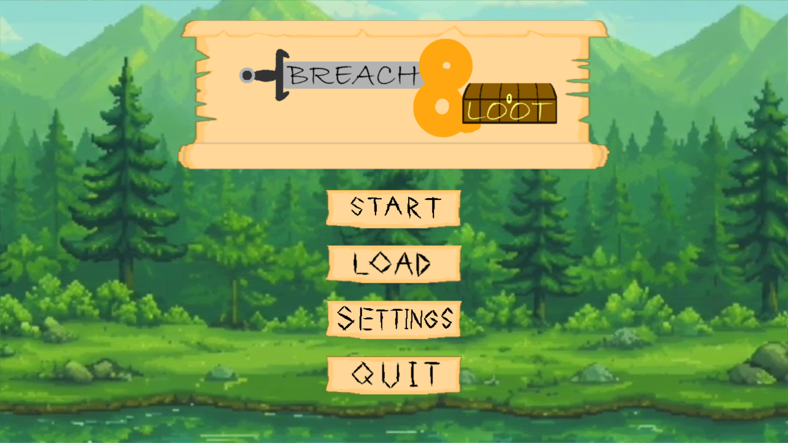
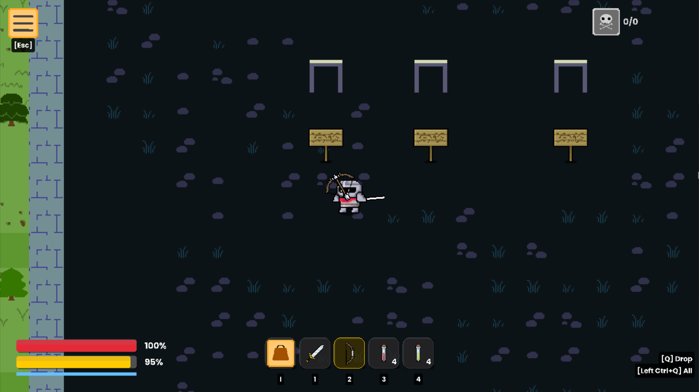
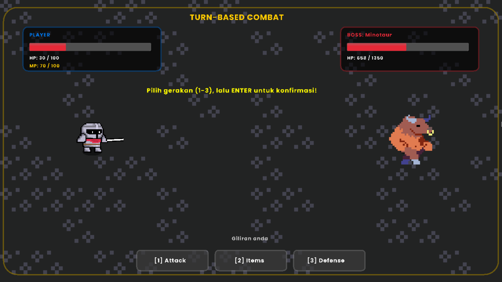
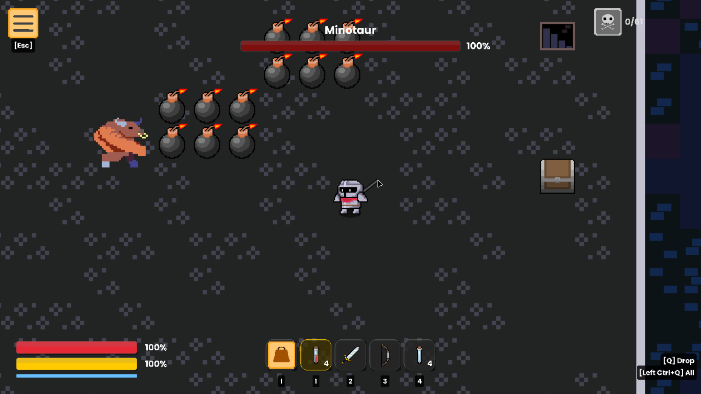
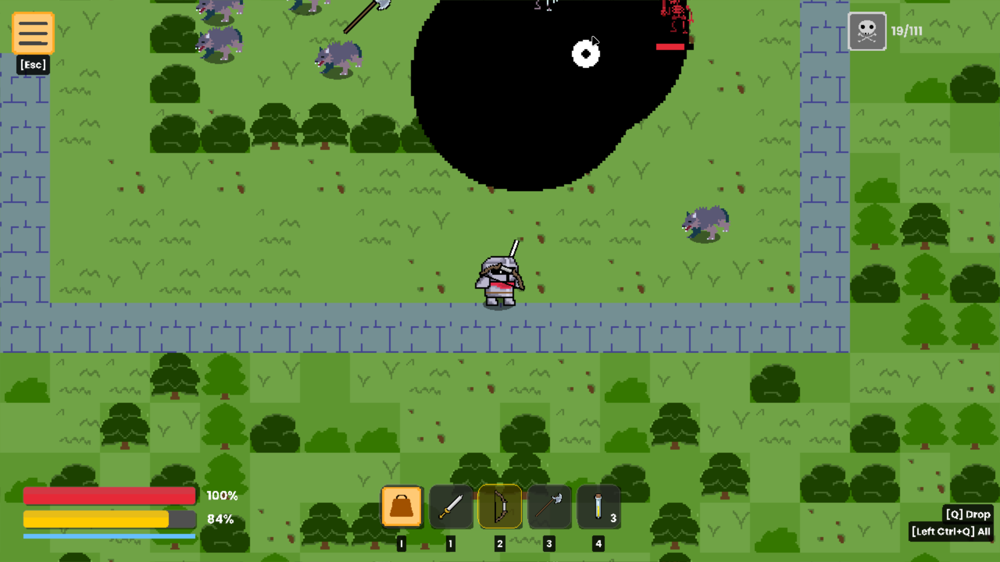
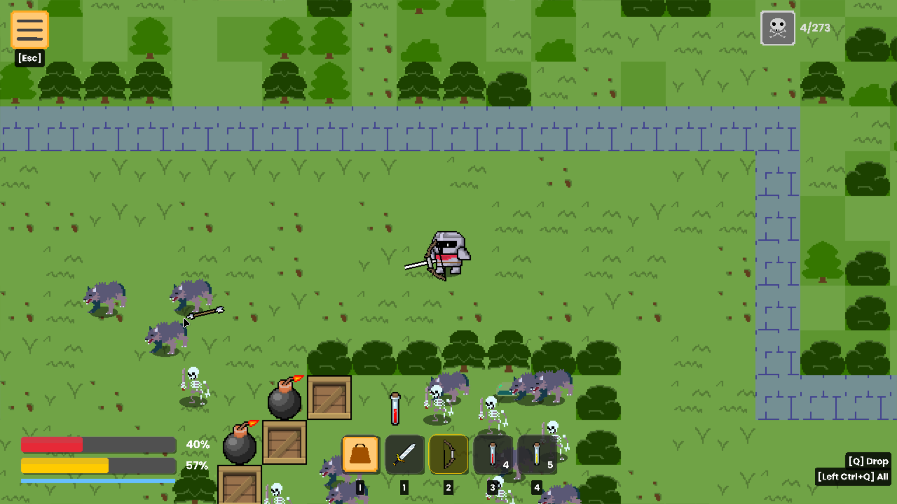

<h1 align="center">BREACH &amp; LOOT</h1>

<!-- Game logo -->


<!-- Screenshot gameplay 2x2 grid -->
<div align="center">
  <table>
    <tr>
      <td align="center" width="50%">
        
      </td>
      <td align="center" width="50%">
        
      </td>
    </tr>
    <tr>
      <td align="center" width="50%">
        
      </td>
      <td align="center" width="50%">
        
      </td>
    </tr>
    <tr>
      <td align="center" width="50%">
        
      </td>
      <td align="center" width="50%">
        
      </td>
    </tr>
  </table>
</div>

Game RPG 2D bertema fantasi yang dibuat dengan Raylib (C++).
<!-- TODO: tambah deskripsi lebih detail -- genre, setting, gameplay loop -->

## Fitur

- Movement & interaksi tilemap (Tileson JSON)
- Combat turn-based dengan entity arrow & efek buff
- Inventory management dengan BST sorting
- Save/load system multi-slot (GameSnapshot + SaveManager)
- UI settings: video, audio, keybind customization
- World generation procedural
- Font system dengan lazy-load atlas caching
- Debug mode dengan overlay informasi

## Persyaratan

- **OS**: Windows 10/11, macOS, atau Linux
- **Compiler**: gcc atau clang
- **CMake**: >= 3.20
- **Ninja**
- **Git**

## Setup & Run (Satu Kali)

Jalankan script sesuai OS kamu:

### Windows

1. Build project dari sumber kode, lalu otomatis menjalankan dengan ini.

    ```powershell
    .\run-windows.ps1
    ```

    Atau double-click `run-windows.bat`.

2. Kemudian, agar tidak memakan waktu untuk build lagi, jalankan file berikut untuk langsung membuka program

   ```batch
   Breach&Loot.bat
   ```

### Linux/macOS

1. Build project untuk membangun program dari sumber kode, lalu otomatis menjalankan dengan ini.

    ```bash
    bash run-linux.sh
    ```

2. Agar tidak membangun lagi, jalankan perintah berikut

   ```bash
   build/bin/main
   ```

> Untuk opsi build lanjutan, lihat [Panduan Build](docs/build.md). Untuk dokumentasi projek lainnya, lihat [Dokumentasi Projek](docs/README.md).
